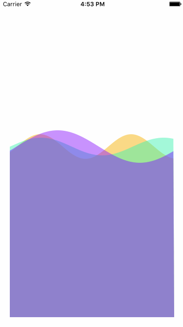

# SineWavesView

This is an example that draws a view with a sine wave placed in teh vertical center with the lower half filled. 
You could use this to create an interesting background effect, learn about math, and study Core Graphics!

There are two classes SineWaveView, and SineWave. The first class draws a SineWave, the second defines a SineWave. 

## Using the SineWaveView and SineWave classes

Add a view to storyboard, and set the Class as: SineWaveView. 

Define a SineWave with: 

let sineWave = SineWave(amplitude: 20, frequency: 1.8, rate: 0.011, color: UIColor(white: 0, alpha: 0.5))

Add a sineWave to your view with: 

sineWaveView.addSineWave(sineWave)

